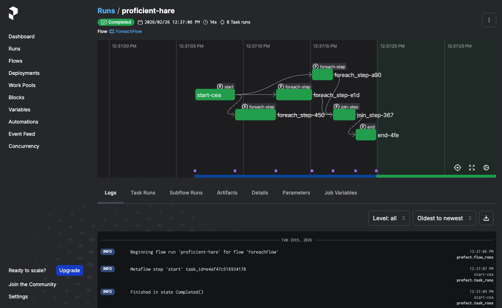
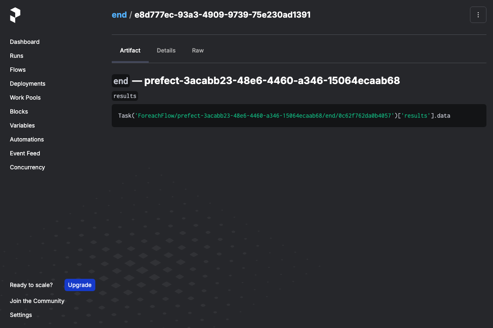

# metaflow-prefect

[](https://github.com/npow/metaflow-prefect/actions/workflows/ci.yml)
[](https://pypi.org/project/metaflow-prefect/)
[](LICENSE)
[](https://www.python.org/downloads/)

Run your Metaflow flows on Prefect without rewriting them.

## The problem

Metaflow is great for defining ML pipelines — but its built-in scheduler is basic. Prefect has
first-class scheduling, observability, and a rich UI, but adopting it means rewriting your flows
from scratch. There's no bridge between the two.

## Quick start

```bash
pip install metaflow-prefect
```

```bash
# Generate a Prefect flow file from your existing Metaflow flow
python my_flow.py prefect create my_flow_prefect.py

# Run it
python my_flow_prefect.py
```

## Install

```bash
pip install metaflow-prefect
```

Or from source:

```bash
git clone https://github.com/npow/metaflow-prefect.git
cd metaflow-prefect
pip install -e ".[dev]"
```

## Usage

### Generate and run a Prefect flow

```bash
python my_flow.py prefect create my_flow_prefect.py
python my_flow_prefect.py
```

### All graph shapes are supported

```python
# Linear
class SimpleFlow(FlowSpec):
    @step
    def start(self):
        self.value = 42
        self.next(self.end)
    @step
    def end(self): pass

# Split/join (branch)
class BranchFlow(FlowSpec):
    @step
    def start(self):
        self.next(self.branch_a, self.branch_b)
    ...

# Foreach fan-out
class ForeachFlow(FlowSpec):
    @step
    def start(self):
        self.items = [1, 2, 3]
        self.next(self.process, foreach="items")
    ...
```

### Parametrised flows

Parameters defined with `metaflow.Parameter` are forwarded automatically:

```bash
python param_flow.py prefect create param_flow_prefect.py
python param_flow_prefect.py --message "hello" --count 5
```

## How it works

`metaflow-prefect` generates a self-contained Prefect flow file from your Metaflow flow's DAG.
Each Metaflow step becomes a `@task`. The generated file:

- runs each step as a subprocess via the standard `metaflow step` CLI
- passes `--input-paths` correctly for joins and foreach splits
- writes Metaflow artifacts to the Prefect UI as markdown artifacts with a ready-to-use retrieval snippet

### Prefect UI: flow run timeline

The generated flow preserves the Metaflow DAG structure — foreach fan-outs appear as parallel task
runs in the Prefect timeline:



### Prefect UI: artifact retrieval snippets

After each step completes, a Prefect artifact is posted showing the Metaflow `self.*` artifact
names and a one-liner to fetch each value:



## Development

```bash
git clone https://github.com/npow/metaflow-prefect.git
cd metaflow-prefect
pip install -e ".[dev]"
pytest -v
```

## License

[Apache 2.0](LICENSE)
