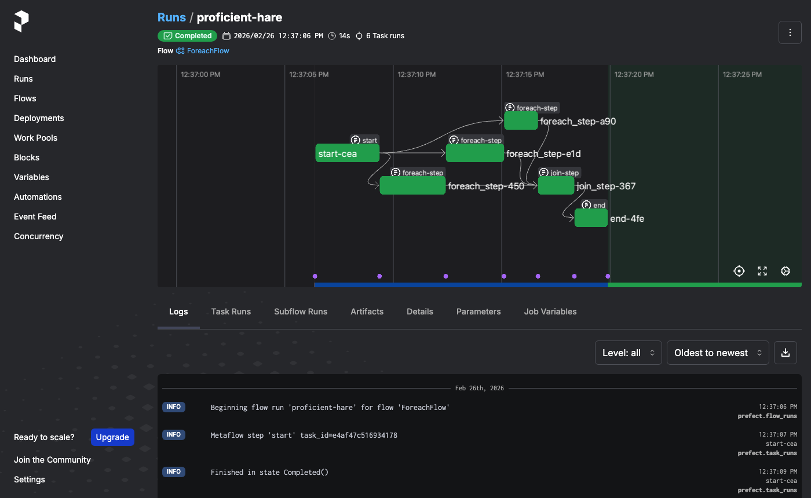
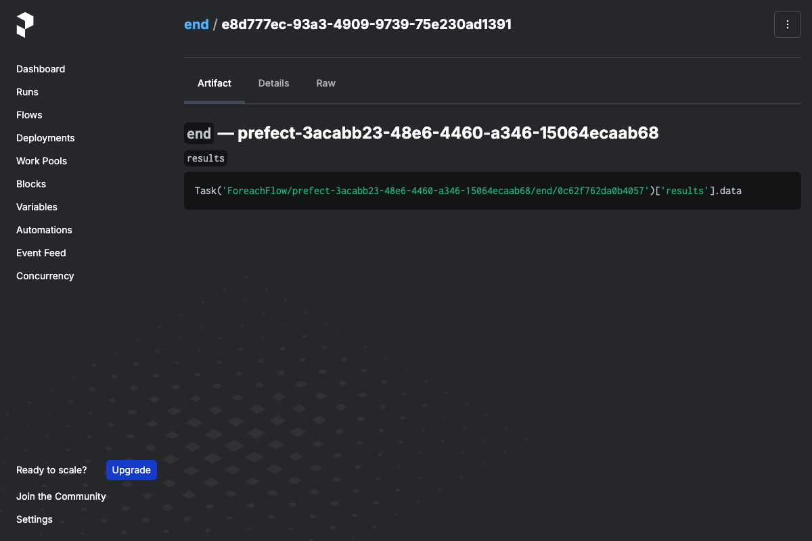

# metaflow-prefect

[](https://github.com/npow/metaflow-prefect/actions/workflows/ci.yml)
[](https://pypi.org/project/metaflow-prefect/)
[](LICENSE)
[](https://www.python.org/downloads/)

Deploy and run Metaflow flows as Prefect deployments.

`metaflow-prefect` generates a self-contained Prefect flow file from any Metaflow flow, letting
you schedule, deploy, and monitor your pipelines through Prefect while keeping all your existing
Metaflow code unchanged.

## Install

```bash
pip install metaflow-prefect
```

Or from source:

```bash
git clone https://github.com/npow/metaflow-prefect.git
cd metaflow-prefect
pip install -e ".[dev]"
```

## Quick start

```bash
# Compile and run locally (no Prefect server needed)
python my_flow.py prefect run

# Register as a named deployment on a Prefect server
python my_flow.py prefect create --name prod --work-pool my-pool
```

## Usage

### Commands

| Command | Description |
|---|---|
| `prefect run` | Compile and run the flow via Prefect locally (ephemeral, no server needed). |
| `prefect resume --clone-run-id <id>` | Re-run a failed flow, skipping steps that already succeeded. |
| `prefect compile <output.py>` | Write the generated Prefect flow file without running it. |
| `prefect create --name <name>` | Register a named deployment on a running Prefect server. |
| `prefect trigger --name <name>` | Trigger a run for an existing deployment. |

```bash
# Run locally
python my_flow.py prefect run

# Resume a failed run (reuses already-completed step outputs)
python my_flow.py prefect resume --clone-run-id prefect-<uuid>

# Deploy to a Prefect server
python my_flow.py prefect create --name prod --work-pool my-pool

# Trigger a run of the deployed flow
python my_flow.py prefect trigger --name prod
```

### All graph shapes are supported

```python
# Linear
class SimpleFlow(FlowSpec):
    @step
    def start(self):
        self.value = 42
        self.next(self.end)
    @step
    def end(self): pass

# Split/join (static branch)
class BranchFlow(FlowSpec):
    @step
    def start(self):
        self.next(self.branch_a, self.branch_b)
    ...

# Conditional (dynamic branch — only one path runs at runtime)
class ConditionalFlow(FlowSpec):
    value = Parameter("value", default=42, type=int)
    @step
    def start(self):
        self.route = "high" if self.value >= 50 else "low"
        self.next({"high": self.high_branch, "low": self.low_branch}, condition="route")
    @step
    def high_branch(self): ...
    @step
    def low_branch(self): ...
    @step
    def join(self): ...

# Foreach fan-out (body tasks run concurrently)
class ForeachFlow(FlowSpec):
    @step
    def start(self):
        self.items = [1, 2, 3]
        self.next(self.process, foreach="items")
    ...
```

### Parametrised flows

Parameters defined with `metaflow.Parameter` are forwarded automatically:

```bash
python param_flow.py prefect run
# Or pass parameters at the CLI:
python param_flow.py prefect compile param_flow_prefect.py
python param_flow_prefect.py --message "hello" --count 5
```

### Step decorator support

`@retry`, `@timeout`, `@environment`, and `@resources` decorators are read from your flow
and applied to the generated Prefect tasks automatically — no changes to your flow code required.

```python
class MyFlow(FlowSpec):
    @retry(times=3, minutes_between_retries=2)
    @timeout(seconds=600)
    @environment(vars={"API_KEY": "secret"})
    @step
    def train(self):
        ...
```

The generated Prefect task becomes:

```python
@task(name="train", retries=3, timeout_seconds=600, retry_delay_seconds=120)
def _step_train(run_id, prev_task_id):
    _extra_env.update({"API_KEY": "secret"})
    ...
```

### Event-based triggers

`@trigger` and `@trigger_on_finish` are wired as Prefect automations when the deployment
is registered. Re-running `prefect create` updates the automations in place.

```python
@trigger_on_finish(flow="UpstreamFlow")
class MyFlow(FlowSpec):
    ...
```

```bash
python my_flow.py prefect create --name prod --work-pool my-pool
# → Registers deployment AND creates a Prefect automation:
#   "on prefect.flow-run.Completed for flow 'UpstreamFlow' → run deployment 'prod'"
```

```python
@trigger(event="data.ready")
class MyFlow(FlowSpec):
    ...
```

```bash
python my_flow.py prefect create --name prod --work-pool my-pool
# → Registers deployment AND creates a Prefect automation:
#   "on event 'data.ready' → run deployment 'prod'"
```

### Resume failed runs

Pass `--clone-run-id` to reuse outputs from steps that already succeeded in a previous run:

```bash
python my_flow.py prefect resume --clone-run-id prefect-<uuid-of-failed-run>
```

## Configuration

### Metadata service and datastore

By default, `metaflow-prefect` uses whatever metadata and datastore backends are active in your
Metaflow environment. The generated Prefect file bakes in `METADATA_TYPE` and `DATASTORE_TYPE`
at creation time so every step subprocess uses the same backend.

To use a remote metadata service or object store, configure them before running `prefect create`:

```bash
# Remote metadata service + S3 datastore
python my_flow.py \
  --metadata=service \
  --datastore=s3 \
  prefect create --name prod --work-pool my-pool
```

Or via environment variables (applied to all flows):

```bash
export METAFLOW_DEFAULT_METADATA=service
export METAFLOW_DEFAULT_DATASTORE=s3
python my_flow.py prefect create --name prod --work-pool my-pool
```

### Flow-level timeout

```bash
python my_flow.py prefect create --name prod --workflow-timeout=3600
```

### Step decorators (`--with`)

Inject Metaflow step decorators at deploy time without modifying the flow source:

```bash
# Run each step inside a sandbox (e.g. metaflow-sandbox extension)
python my_flow.py prefect run --with=sandbox

# Multiple decorators supported at deployment time
python my_flow.py prefect create --name prod \
  --with=sandbox \
  --with="resources:cpu=4,memory=8000"
```

### `@project` support

Flows decorated with `@project` use a project-qualified name for the deployment:

```python
@project(name="my-team")
class MyFlow(FlowSpec):
    ...
```

```bash
# Deployment will be registered as "my-team.MyFlow"
python my_flow.py prefect create --name prod
```

## How it works

`metaflow-prefect` generates a self-contained Prefect flow file from your Metaflow flow's DAG.
Each Metaflow step becomes a `@task`. The generated file:

- runs each step as a subprocess via the standard `metaflow step` CLI
- streams stdout and stderr from each step subprocess to the Prefect logger in real time
- passes `--input-paths` correctly for joins and foreach splits
- runs foreach body tasks concurrently via Prefect's task runner
- maps `@retry`, `@timeout`, `@environment`, and `@resources` decorators to Prefect task settings
- writes Metaflow artifacts to the Prefect UI as markdown artifacts with a ready-to-use retrieval snippet
- creates Prefect automations for `@trigger` and `@trigger_on_finish` when deploying

### Prefect UI: flow run timeline

The generated flow preserves the Metaflow DAG structure — foreach fan-outs appear as parallel task
runs in the Prefect timeline:



### Prefect UI: artifact retrieval snippets

After each step completes, a Prefect artifact is posted showing the Metaflow `self.*` artifact
names and a one-liner to fetch each value:



## Supported decorators

| Decorator | Behaviour |
|---|---|
| `@retry(times=N, minutes_between_retries=M)` | Maps to `@task(retries=N, retry_delay_seconds=M*60)` |
| `@timeout(seconds=N)` / `@timeout(minutes=N)` | Maps to `@task(timeout_seconds=N)` |
| `@environment(vars={...})` | Merges vars into the step subprocess environment |
| `@resources(cpu=N, gpu=G, memory=M)` | Added as Prefect task tags; GPU steps get a concurrency tag. Advisory only — configure matching resources on the work pool. |
| `@schedule(cron=...)` | Used as the deployment cron schedule |
| `@project(name=...)` | Prefixes the deployment name with the project name |
| `@trigger(event=...)` | Creates a Prefect automation that fires the deployment on the named event |
| `@trigger_on_finish(flow=...)` | Creates a Prefect automation that fires the deployment when the upstream Prefect flow completes |

Unsupported decorators (`@batch`, `@slurm`, `@exit_hook`, `@parallel`)
raise a clear error at compile time.

## Limitations

| Limitation | Detail |
|---|---|
| No `parallel_foreach` | `parallel_foreach=True` (Metaflow's MPI-style multi-node execution) requires `@batch` or `@kubernetes` backends and runs as a single distributed job, which has no Prefect equivalent. Raises an error at compile time. |
| `@resources` tags are advisory | CPU/GPU/memory hints are added as Prefect task tags and are visible in the UI, but do not automatically allocate resources — configure matching resources on the work pool. |
| `@trigger` event scope | `@trigger(event="foo")` watches for a Prefect event named `"foo"`. Metaflow's own event system is separate from Prefect's — emit events via Prefect's event API to use this trigger. |

## Development

```bash
git clone https://github.com/npow/metaflow-prefect.git
cd metaflow-prefect
pip install -e ".[dev]"
pytest -v
```

## License

[Apache 2.0](LICENSE)
